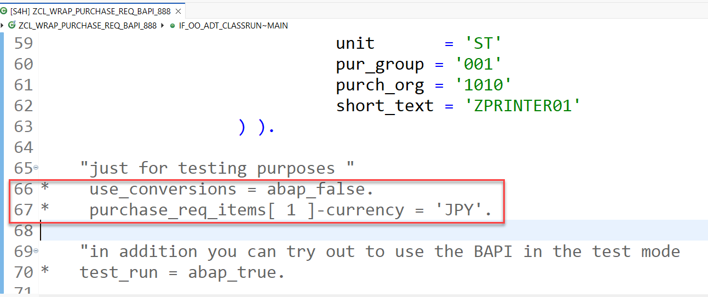
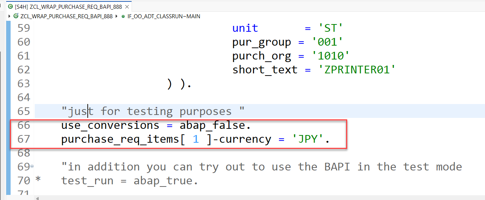
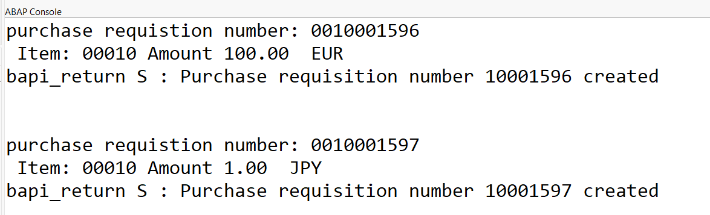

 # Exercise 1: Implement a Wrapper for the "Create Purchase Requisition" (BAPI_PR_CREATE) function module
<!-- description --> Learn how to wrap the BAPI_PR_CREATE in your SAP S/4HANA system and release it for consumption in ABAP for cloud development.

## Prerequisites

When you want to perform this script in your own SAP S/4HANA system the following prerequisites must be met:     

- You have to have a system based on **SAP S/4HANA 2022 or 2023** on premise or private cloud.
- You have to have enabled Developer extensibility as described in the [SAP Online Help](https://help.sap.com/docs/ABAP_PLATFORM_NEW/b5670aaaa2364a29935f40b16499972d/31367ef6c3e947059e0d7c1cbfcaae93.html?q=set%20up%20developer%20extensibility&locale=en-US)   
- You have to apply the following notes:  

  - [SAP Note 3444292 - ACO Proxy creates unnecessary shadow types](https://me.sap.com/notes/3444292)  
  - [SAP Note 3457580 - SAP ACO - Duplicate Types for Table Parameters](https://me.sap.com/notes/3457580)
  - [SAP Note 3518177 - SAP ACO Proxy Improvements](https://me.sap.com/notes/3518177)
  - [SAP Note 3519098 - F4: fix function module value help](https://me.sap.com/notes/3519098)   (only relevant for SAP S/4 HANA 2023)   

## Introduction
Now that you're connected to your SAP S/4HANA system, go ahead with this exercise where you will learn how to deal with the situation where there is no convenient released SAP API for creating purchase requisitions. 

The [ABAP Cloud API Enablement Guidelines for SAP S/4HANA Cloud Private Edition and SAP S/4HANA](https://www.sap.com/documents/2023/05/b0bd8ae6-747e-0010-bca6-c68f7e60039b.html) recommend using a _Classic API_ such as an appropriate BAPI as an alternative to a released API, wrapping it, and then releasing the wrapper for _use in cloud 
development_. 

In a later exercise you will then create a Shopping Cart RAP business object for a Fiori elements online shopping app using the ABAP Cloud development model and integrate this wrapper to create purchase requisitions.

- [You will learn](#you-will-learn)
- [Summary & Next Exercise](#summary--next-exercise)  


## You will learn
- How to generate a wrapper interface, a wrapper class and a factory class for the `BAPI_PR_CREATE` using transaction ACO_PROXY.
- How to create an ABAP package in a software component with 
language version ABAP for Cloud Development (superpackage: `ZLOCAL`)   
- How to test that the wrapper objects have been released for for _use in cloud development_.

> **Reminder:**   
> Don't forget to replace all occurences of the placeholder **`###`** with your assigned group number in the exercise steps below.  
> You can use the ADT function **Replace All** (**Ctrl+F**) for the purpose.   
> If you don't have a group number, choose a 3-digit suffix and use it for all exercises.


## Step 1: Get to know the BAPI _`BAPI_PR_CREATE`_ via the BAPI Explorer

<details>
  <summary>🔵 Click to expand!</summary>
  
The first step is to look for a suitable classic API to create purchase requisitions. You can use the BAPI Explorer for this purpose. Connect to the backend of your SAP S/4HANA system and start transaction **`BAPI`** by opening the embedded SAP GUI (**Ctrl+6**) and entering **`/nBAPI`** in the command field. For the purpose of this tutorial, we will use the non-released BAPI **`BAPI_PR_CREATE`**.

For that, switch to the **Alphabetical** view (1), look for the Business Object **`PurchaseRequisition`** (2), find and click on the method **`CreateFromData1`** (3). You can see that its function module is the **`BAPI_PR_CREATE`** (4).

<!--  -->


In the **Documentation** tab you can find more information on what the BAPI is used for (in this case: to create purchase requisitions) and you can find examples for various scenarios and how to fill the respective parameter values.

In the **Tools** section you can click on the **Function Builder** and then click on **Display** to see the required parameters:

<!--  -->


<!--  -->


>The `BAPI_PR_CREATE` has a `TESTRUN` parameter that can be used to call the BAPI in validation mode. Some BAPI have a similar test mode that can be used to validate input data. It is best practice to make use of this test mode, if available, as we will address in more details in a later [exercise](./exercises/ex5/Readme.md) of this hands-on.

</details>

## Step 2: Create a development package in HOME or an existing software component for classic ABAP

You will develop the wrapper in a dedicated package under the structure package **`ZTIER2`** in your SAP S/4HANA system.   

<details>
  <summary>🔵 Click to expand</summary>
  
  1. In ADT, open your SAP S/4HANA system project folder, right click on it and select **New** > **ABAP Package** and enter the following values:   

     - Name:         **`ZTIER2_###`**   
     - Superpackage: **`ZTIER2`**      
     - Description:  **`Group ### - Tier2`.**      

  2. Select **Add to favorite packages** for easy access later on. Keep the Package Type as **Development** and click on **Next**.  

  3. Do not change anything in the following wizard window (where the software component HOME is selected), and click on **Next**.       

         

  4. Create a new transport request and give it a meaningful name such as `classic ABAP development - Group ###` so that it can be more easily identified. 
     Then click on **Finish**. The package will be created.   


</details>  

## Step 3: Generate a technical wrapper class, interface and factory class

You now want to wrap the API `BAPI_PR_CREATE`. For this we use the transaction **ACO_PROXY** which has been enhanced so that it will generate the boiler plate coding for you to build a wrapper class.   

In the following we will explain in short the best practices that are behind the options you will have to choose when using transaction **ACO_PROXY**.  

<details>
  <summary>🔵 Click to expand</summary>

> **The interface:**     
> Depending on your specific use-case, you normally would need to access only certain specific functionalities and methods of the BAPI you want to expose. An ABAP Interface is the perfect development object for this purpose. The interface simplifies and restricts the usage of the underlying BAPI for the specific use-case, by exposing only the parameters that are needed. As a consequence, non-wrapped functionalities are forbidden.

> **The wrapper class:**    
> In addition you need a class to wrap the BAPI (implementing the interface) and implement its methods. The wrapper class has a method defined in the private section, `call_bapi_pr_create`, which has access to all the parameters of the underlying BAPI. Having this type of central private method is best practice. Internally, the wrapper class has access to all the parameters and then the interface has virtual access to all of these parameters and exposes publicly only the ones that are needed depending on the specific use-case. 

> **C1-release for use in cloud development:**    
> Since we plan to access the wrapped BAPI using the ABAP Cloud development model, it is good to provide the possibility to test it, and to keep wrapping-specific coding using the ABAP Cloud development model to a minimum. For this reason, the interface approach is recommended, and the wrapper class will not be released directly for consumption in ABAP for cloud development, but rather will be accessible via a factory class that will also be created.

> **The factory class:**
> A factory class is used to control the instantiation of the wrapper class and in order to be able to use it in ABAP for cloud development it has to be released for use in ABAP for cloud development. 

This approach has the advantage of a clear control of when and where an instance of the wrapper class is created, and in the event in which several wrapper classes are needed all their instantiations could be handled inside one single factory class.  Also, in case of wrapper classes this has the advantage that in case the wrapper class is changed throughout it's software lifecycle, at a later point in time a different class could be initialized, without changes to the consumer implementation. In this tutorial we follow the [clean code best practices](https://blogs.sap.com/2022/05/05/how-to-enable-clean-code-checks-for-abap/) for ABAP development. For example: the wrapper class is ready for ABAP Unit Tests and [ABAP Doc](https://blogs.sap.com/2013/04/29/abap-doc/) is implemented.


1. To create the interface, the class and the factory class for your BAPI start transaction **ACO_PROXY**.  

2. Enter the following values:   

   **A. Function Modules**    
      - Here you can select one or more function modules that will be wrapped by one single class. Please enter here only `BAPI_PR_CREATE`.  
        
   **B. Specify repository object names**    
      - **Name of a proxy class**: Enter a name for the wrapper class, e.g. `ZCL_WRAP_BAPI_PR_###`.   
      - **Package**: Select `ZTIER2_###`.       
      - **Create Interface**: Check the check box and choose a name for the interface, e.g. `ZIF_WRAP_BAPI_PR_###`  
      - **Create Factory Class**: Check the check box and choose a name for the factory class, e.g. `ZCL_F_WRAP_BAPI_PR_###`   

   **C. Options**   
      - Leave the default value **Pass destination via Constructor**  checked.   
      - Choose the radio-button **Class-Based Exceptions**       
      - Check the check box **Do not create Shadows of C1 Released Types**       
      - Check the check box **C1 Release**       
      - Check the check box **Create Private Methods**          

    
    

3. Press the green check mark <code style="color : name_color">**✔**</code> in the upper left corner or  **F8** to continue
   
4. Select optional values

   Transaction **ACO_PROXY** offers you to un-select optional values that shall not be part of the public interface.

   Only leave the following optional parameters of the 'BAPI_PR_CREATE' selected
   
   - NUMBER  
   - PRHEADEREXP  
   - PRHEADER  
   - PRHEADERX  
   - TESTRUN  
   - PRITEMX  
   - RETURN  

   and un-select all other optional parameters.

   Finally you have to press **Enter** and you have to select a transport to start the generation of the repository objects.   

   

   

   


6. Check the generated artefacts.

       
   

 
</details>  

## Step 4: Create a package in a software component with language version ABAP for Cloud Development   

**Hint:** In case no CAL instance of a preconfigured SAP S/4HANA appliance is used, please set up for developer extensibility to get `ZTIER1` package as described in section **Prerequisites**.    

<details>
  <summary>🔵 Click to expand</summary>

  1. In ADT, open your SAP S/4HANA system project folder, right click on it and select **New** > **ABAP Package**.
  2. Enter the following values:         

     - Name:         **`Z_PURCHASE_REQ_###`**
     - Superpackage: **`ZTIER1`**
     - Description:  **`Group ### - Tier1`.**      

     Select **Add to favorite packages** for easy access later on. Keep the Package Type as **Development** and click on **Next**.    

  7. Click on **Next** and then **Next** again. Select a suitable transport request (or create a new one if needed) and then click on **Finish**.

    
      
</details>

## Step 5: Test the technical wrapper class with console application in ABAP for cloud development

The wrapper you just created is released for consumption in ABAP for cloud development. You can test this by creating a console application in ABAP for cloud development to call the wrapper. 

We will use this class that calls the wrapper also to add a conversion functionality and to simplify the signature of the method that is used to create a purchase requistion as well. 

For this you have created a dedicated package **`Z_PURCHASE_REQ_###`** for this test in ABAP for cloud development by using **`ZTIER1`** as the super-package of your package in your SAP S/4HANA System.

<details>
  <summary>🔵 Click to expand</summary>  
   
1. Create a class for the console application.  
   Right click on the newly created package **`Z_PURCHASE_REQ_###`** and select **New** > **ABAP Class** and enter the following values:  
    - **Name**: **`zcl_wrap_purchase_req_bapi_###`**   
    - **Description**: **Wrapper and test class**  

2. Click on **Next**, select a suitable transport request (or create a new one if needed) and then click on **Finish**.

3. You can check that the newly created class is a ABAP for cloud development class by checking that the **ABAP Language Version** is `ABAP Language for Cloud Development` in the **Properties** > **General** tab:

<!--  -->


4. Implement the newly created class as shown below. The class calls the wrapper factory class and, given some input parameter values like the delivery date and the item price, creates a purchase requisition for that specific item and prints the information to the console.   
         
 <details>
  <summary>🟡📄 Click to expand and view or copy the source code!</summary>

```ABAP

CLASS zcl_wrap_purchase_req_bapi_### DEFINITION
  PUBLIC
  FINAL
  CREATE PUBLIC .

  PUBLIC SECTION.

    INTERFACES if_oo_adt_classrun .

    DATA use_conversions TYPE abap_boolean VALUE abap_true READ-ONLY.

    METHODS bapi_pr_create
      IMPORTING purchase_req_header TYPE zif_wrap_bapi_pr_###=>bapimereqheader
                purchase_req_items  TYPE zif_wrap_bapi_pr_###=>_bapimereqitemimp
                test_run            TYPE abap_bool
      EXPORTING pr_return_msg       TYPE zif_wrap_bapi_pr_###=>_bapiret2
      RETURNING VALUE(result)       TYPE banfn.


  PROTECTED SECTION.
  PRIVATE SECTION.


ENDCLASS.


CLASS zcl_wrap_purchase_req_bapi_### IMPLEMENTATION.
  METHOD if_oo_adt_classrun~main.

    DATA pr_returns TYPE bapirettab.

    "if the data element banfn is not released for the use in cloud develoment in your system
    "you have to use the shadow type zif_wrap_bapi_pr_###=>banfn
    DATA number  TYPE banfn  .
    "DATA number  TYPE zif_wrap_bapi_pr_###=>banfn  .

    DATA purchase_req_header TYPE zif_wrap_bapi_pr_###=>bapimereqheader .
    DATA purchase_req_items  TYPE zif_wrap_bapi_pr_###=>_bapimereqitemimp .

    DATA test_run TYPE abap_boolean .

    purchase_req_header = VALUE #( pr_type = 'NB' ).

    purchase_req_items = VALUE #( (
                              preq_item  = '00010'
                              plant      = '1010'
                              acctasscat = 'U'
                              currency   = 'EUR'                              
                              deliv_date = cl_abap_context_info=>get_system_date(  ) + 14   "format: yyyy-mm-dd (at least 10 days)
                              material   = 'ZPRINTER01'
                              matl_group = 'A001'
                              preq_price = '100'
                              quantity   = '1'
                              unit       = 'ST'
                              pur_group = '001'
                              purch_org = '1010'
                              short_text = 'ZPRINTER01'
                    ) ).

    "just for testing purposes "
*    use_conversions = abap_false.
*    purchase_req_items[ 1 ]-currency = 'JPY'.

    "in addition you can try out to use the BAPI in the test mode
*   test_run = abap_true.

    bapi_pr_create(
      EXPORTING
        purchase_req_header     = purchase_req_header
        purchase_req_items      = purchase_req_items
        test_run                = test_run
      IMPORTING
        pr_return_msg = pr_returns
      RECEIVING
        result        = number
    ).

    COMMIT WORK AND WAIT.

    IF test_run = abap_true.
      out->write( | test_run | ).
    ELSE.
      out->write( |purchase requistion number: { number  } | ).

      SELECT * FROM I_PurchaseRequisitionItemAPI01 WHERE PurchaseRequisition = @number
                                         INTO TABLE @DATA(purchase_requisitions).

      LOOP AT purchase_requisitions INTO DATA(purchase_requisition).
        out->write( | Item: { purchase_requisition-PurchaseRequisitionItem } Amount { purchase_requisition-PurchaseRequisitionPrice }  { purchase_requisition-PurReqnItemCurrency }| ).
      ENDLOOP.

    ENDIF.

    LOOP AT pr_returns INTO DATA(bapiret2_line).
      out->write( |bapi_return { bapiret2_line-type } : { bapiret2_line-message } | ).
    ENDLOOP.

  ENDMETHOD.


  METHOD bapi_pr_create.

*    DATA prheader TYPE zif_wrap_bapi_pr_###=>bapimereqheader .
    DATA prheaderx TYPE zif_wrap_bapi_pr_###=>bapimereqheaderx .
    DATA pritem  TYPE zif_wrap_bapi_pr_###=>_bapimereqitemimp .
    DATA pritemx  TYPE zif_wrap_bapi_pr_###=>_bapimereqitemx  .
    DATA pritemx_line LIKE LINE OF pritemx.
    DATA prheaderexp  TYPE zif_wrap_bapi_pr_###=>bapimereqheader .
    DATA conversion_message_line TYPE bapiret2.

    "if the data element banfn is not released for the use in cloud develoment in your system
    "you have to use the shadow type zif_wrap_bapi_pr_###=>banfn
    DATA number  TYPE banfn  .
    "DATA number  TYPE zif_wrap_bapi_pr_###=>banfn  .
    DATA conversion_messages TYPE bapirettab.

    prheaderx = VALUE #( pr_type = 'X' ).

    "item data has to be converted
    pritem = purchase_req_items.

    LOOP AT pritem ASSIGNING FIELD-SYMBOL(<pritem_line>).

      pritemx_line =
                      VALUE #(
                               preq_item  = '00010'
                               plant      = 'X'
                               acctasscat = 'X'
                               currency   = 'X'
                               deliv_date = 'X'
                               material   = 'X'
                               matl_group = 'X'
                               preq_price = 'X'
                               quantity   = 'X'
                               unit       = 'X'
                               pur_group  = 'X'
                               purch_org  = 'X'
                               short_text = 'X'
                              ) .

      APPEND pritemx_line TO pritemx.

      IF use_conversions = abap_true.

        TRY.

            zcl_conversion_ext_int=>get_instance( )->currency_amount_int_to_ext(
              EXPORTING
                currency    = <pritem_line>-Currency
                sap_amount  = CONV #( <pritem_line>-preq_price )
              IMPORTING
                bapi_amount = DATA(bapi_amount)
            ).

            zcl_conversion_ext_int=>get_instance( )->currency_code_int_to_ext(
              EXPORTING
                sap_code = <pritem_line>-Currency
              IMPORTING
                iso_code = DATA(bapi_currency)
            ).

            <pritem_line>-preq_price = bapi_amount.
            <pritem_line>-Currency = bapi_currency.

          CATCH zcx_conversion_ext_int INTO DATA(conversion_exception).

            conversion_message_line-id = conversion_exception->if_t100_message~t100key-msgid.
            conversion_message_line-number = conversion_exception->if_t100_message~t100key-msgno.
            conversion_message_line-type = if_abap_behv_message=>severity-warning.
            conversion_message_line-message_v1 = conversion_exception->attr1.
            conversion_message_line-message_v2 = conversion_exception->attr2.
            APPEND conversion_message_line TO conversion_messages.

        ENDTRY.
      ENDIF.
    ENDLOOP.

    TRY.
        zcl_f_wrap_bapi_pr_###=>create_instance( )->bapi_pr_create(
            EXPORTING
              prheader  = purchase_req_header
              prheaderx = prheaderx
              testrun   = test_run
            IMPORTING
              number      = number
              prheaderexp = prheaderexp
            CHANGING
              pritem          = pritem
              pritemx         = pritemx
              return          = pr_return_msg
              )
          .
        result = number.

        APPEND LINES OF conversion_messages TO pr_return_msg.

      CATCH cx_aco_application_exception cx_aco_communication_failure cx_aco_system_failure.
        "does not happen since there is no rfc call
        ASSERT 1 = 2.
    ENDTRY.

  ENDMETHOD.

ENDCLASS.


```

 </details>   

5. Save and activate your changes.   

6. Now run this class  by pressing F9.   

7. You shall see an output as follows:

      

> Tip:  
> Add a breakpoint in the `bapi_pr_create()` method of your coding where your technical wrapper class `zcl_f_wrap_bapi_pr_###` is being called.    
> `zcl_f_wrap_bapi_pr_###=>create_instance( )->bapi_pr_create`   
  
 </details>


## Step 6: Understand conversion problems

### Introduction

For historical reasons currency amounts in the SAP system, are all stored with two decimal places. Currency amounts thus have to be converted from an SAP system format to a format that can be understood externally, if a currency has a different number of decimal places. For example, a currency amount stored SAP internally as 100.00 may de-facto mean 10000 if it is about Japanese Yen.  

Another use case where conversion takes place between the data format that is used externally and the data that is used withing an SAP system is the conversion of currency codes and unit codes between SAP internal and external (ISO) ones.   

Since BAPI's have been designed as external API's they expect that data is provided in the external format. The data of the payload of an OData request that is accessible in the behavior implementation class has however already been converted to the SAP internal format.   

This means that when calling a BAPI we have to convert data such as amounts back to the external format. In the ABAP language version **ABAP Standard** you would be able to use the function modules such as `currency_amount_sap_to_idoc` to perform this conversion.   

Since this function module and other function modules that perform these conversions are however **not released** for the use in cloud development, a wrapper class is needed. For your convenience we have provided the class `zcl_conversion_ext_int` for this purpose that is available in systems that have been provided by SAP for hands-on workshops. It is planned to provide a class as part of the SAP standard in the near future as well. This class is also planned to be made available as SAP Note for lower releases.   

<details>
  <summary>🔵 Click to expand to check the conversion problem!</summary>
  

### Check the conversion problem  

1. Open the class `zcl_wrap_purchase_req_bapi_###` in ADT.
2. Start the class by pressing **F9**.
3. Navigate to the `main` method
4. Remove the comment **Ctrl+>** from the lines   

   ```   
   *   use_conversions = abap_false.`
   *   purchase_req_items[ 1 ]-currency = 'JPY'.
   ```  
      

5. Your code should now look like as follows:   

      
   
8. Save and activate your changes.
9. Start the class by pressing **F9**.  

      
 
By setting the global variable `use_conversions` to `abap_false` for testing purposes you have changed the behavior of your wrapper class such, that:   
- now Japanese Yen will be used to create the purchase requisition and that
- in method `bapi_pr_create()` now the conversion class `zcl_conversion_ext_int` is not used anymore to convert the amount from the SAP internal format to the external format   

As a result the value stored in the purchase requisition would be `1 JPY` instead of the intended amount `100 JPY`.   
  
</details>   

## Step 7: Fix conversion problem using released conversion class

Navigate to the method `bapi_pr_create()` in your wrapper class `zcl_wrap_purchase_req_bapi_###`.    

Here you see that the wrapper class takes the values of the incoming payload stored in the import parameter `purchase_req_items` and moves it to the internal table `pritem` because the values of the import parameter are read-only.   

Using the class C1-released class `zcl_conversion_ext_int` the content of the fields `amount` and `currency` are being converted from the SAP internal format to the external format expected by the BAPI.    

The variable `use_conversions` is read-only and set to `abap_true` when instanticiating the class and has only been set to `abap_false` for testing purposes in the `main()` method.   

<details>
  <summary>🔵 Click to expand the source code!</summary>   
  
```

    "item data has to be converted
    pritem = purchase_req_items.

    LOOP AT pritem ASSIGNING FIELD-SYMBOL(<pritem_line>).

      pritemx_line =
                      VALUE #(
                               preq_item  = '00010'
                               plant      = 'X'
                               acctasscat = 'X'
                               currency   = 'X'
                               deliv_date = 'X'
                               material   = 'X'
                               matl_group = 'X'
                               preq_price = 'X'
                               quantity   = 'X'
                               unit       = 'X'
                               pur_group  = 'X'
                               purch_org  = 'X'
                               short_text = 'X'
                              ) .

      APPEND pritemx_line TO pritemx.

      IF use_conversions = abap_true.

        TRY.

            zcl_conversion_ext_int=>get_instance( )->currency_amount_int_to_ext(
              EXPORTING
                currency    = <pritem_line>-Currency
                sap_amount  = CONV #( <pritem_line>-preq_price )
              IMPORTING
                bapi_amount = DATA(bapi_amount)
            ).

            zcl_conversion_ext_int=>get_instance( )->currency_code_int_to_ext(
              EXPORTING
                sap_code = <pritem_line>-Currency
              IMPORTING
                iso_code = DATA(bapi_currency)
            ).

            <pritem_line>-preq_price = bapi_amount.
            <pritem_line>-Currency = bapi_currency.

          CATCH zcx_conversion_ext_int INTO DATA(conversion_exception).

            conversion_message_line-id = conversion_exception->if_t100_message~t100key-msgid.
            conversion_message_line-number = conversion_exception->if_t100_message~t100key-msgno.
            conversion_message_line-type = if_abap_behv_message=>severity-warning.
            conversion_message_line-message_v1 = conversion_exception->attr1.
            conversion_message_line-message_v2 = conversion_exception->attr2.
            APPEND conversion_message_line TO conversion_messages.

        ENDTRY.
      ENDIF.
    ENDLOOP.


```  

</details>    


 
<!--    

## Step 8: Run ATC checks and request exemptions \[OPTIONAL\]

> **Note**: This exercise is optional. 

You will now need to run ATC checks on the objects you created and request exemptions to use non-released API.

<details>
  <summary>🔵 Click to expand</summary>  

To run the ATC checks right click on the `$Z_PURCHASE_REQ_TIER2_###` package and select **Run As** > **ABAP Test Cockpit With...** and select your ATC check variant. Confirm by clicking on **OK**.   


The result of the ATC check will appear in the ATC Problems tab. As expected, you will get ATC check errors because you are using an non-released API:


>Note that there are ATC checks errors for both the interface and the wrapper class. You will need to request an exemption for each of the two objects.

Right click on any one of the interface related errors in the ATC Problems tab and choose **Request Exemption**. You can then request an exemption for the whole interface by selecting `Interface (ABAP Objects)` under the `Apply exemption To` tab:


Click **Next**, choose a valid approver, a reason to request the exemptions and input a justification for it. Then click on **Finish**.


Proceed in the same way to request an exemption for the whole wrapper class.

>How to maintain approvers and how to approve exemptions is beyond the scope of this tutorial. After a maintained approver has approved the exemptions, you can verify it by running ATC checks again in ADT: no issue should arise.

</details>

-->   

<!--
## Step 10: Check the results in the SAP standard `Purchase Requisition - Professional` App

You can  use the app **Manage Purchase Requisition - Professional** to check the purchase requistions that you have created using your console application.   

<details>
  <summary>🔵 Click to expand</summary>
  
  1. In a preconfigured appliance system, the standard **Manage Purchase Requisition - Professional** app can be started using the ABAP Fiori Launchpad using the following URL, where you will replace `xxx.xxx.xxx.xxx` with your assigned system IP address:     
  
     https://xxx.xxx.xxx.xxx:44301/sap/bc/ui2/flp?sap-client=100&sap-language=EN#PurchaseRequisition-maintain
    
     > **Hint:** Alternatively, you can launch the ABAP Fiori launchpad using the transaction code **`/ui2/flp`** (`/n/ui2/flp`) and then search for the app *Manage Purchase Requisition - Professional*.

     **Manage Purchase Requistion - SAP standard application**   
       
    
     Now you can search for the created purchase requisition number.

     > **Note**
     > Before checking the results in the ADT Fiori Elements preview make sure to clear the cache by pressing **F12** and by selecting **clear cache and refresh**. Otherwise you might run into the issue that the button 
       of the action is visible but not functional.   

</details>
-->

## Summary & Next Exercise
[^Top of page](#)

Now that you've... 
- created a wrapper interface, a factory class and an implementing wrapper class for the BAPI_PR_CREATE, and
- have tested the C1-released wrapper for consumption in ABAP for cloud development,

you can continue with the next exercise - **[Exercise 2 - Create a Shopping Cart Business Object](../ex2/README.md)**.

---
