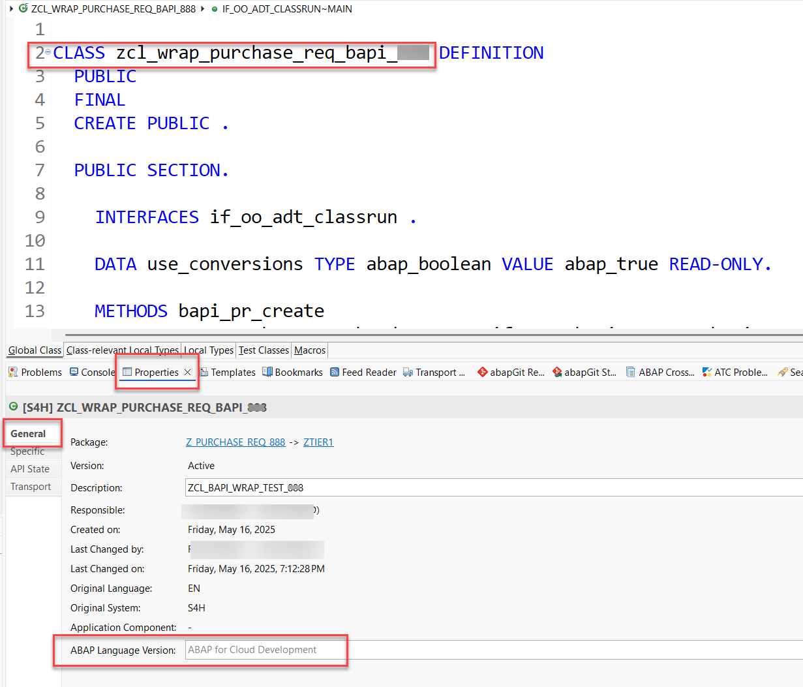

# Exercise 1: Implement a Wrapper for the "Create Purchase Requisition" (BAPI_PR_CREATE) function module
<!-- description --> Learn how to wrap the BAPI_PR_CREATE in your SAP S/4HANA system and release it for consumption in tier 1.


## Introduction
Now that you're connected to your SAP S/4HANA system, go ahead with this exercise where you will learn how to deal with the situation where there is no convenient released SAP API for creating purchase requisitions. 

The [ABAP Cloud API Enablement Guidelines for SAP S/4HANA Cloud Private Edition and SAP S/4HANA](https://www.sap.com/documents/2023/05/b0bd8ae6-747e-0010-bca6-c68f7e60039b.html) recommend using a BAPI as an alternative to a released API, wrapping it, and then releasing the wrapper for consumption in tier 1. 

In a later exercise you will then create a Shopping Cart RAP business object for a Fiori elements online shopping app and integrate this wrapper to create purchase requisitions.

- [You will learn](#you-will-learn)
- [Summary & Next Exercise](#summary--next-exercise)  


## You will learn
- How to create a wrapper interface and implement a wrapper class for the `BAPI_PR_CREATE`.
- How to release the wrapper for consumption in tier 1.

> **Reminder:**   
> Don't forget to replace all occurences of the placeholder **`###`** with your assigned group number in the exercise steps below.  
> You can use the ADT function **Replace All** (**Ctrl+F**) for the purpose.   
> If you don't have a group number, choose a 3-digit suffix and use it for all exercises.


## Step 1: Get to know the BAPI_PR_CREATE via the BAPI Explorer

<details>
  <summary>🔵 Click to expand!</summary>
  
The first step is to look for a suitable non-released API to create purchase requisitions. You can use the BAPI Explorer for this purpose. Connect to the backend of your SAP S/4HANA system and start transaction `BAPI`. For the purpose of this tutorial, we will use the non-released BAPI `BAPI_PR_CREATE`: switch to the **Alphabetical** view (1), look for the Business Object `PurchaseRequisition` (2), find and click on the method `CreateFromData1` (3). You can see that its function module is the `BAPI_PR_CREATE` (4).

<!--  -->


In the **Documentation** tab you can find more information on what the BAPI is used for (in this case: to create purchase requisitions) and you can find examples for various scenarios and how to fill the respective parameter values.

In the **Tools** section you can click on the **Function Builder** and then click on **Display** to see the required parameters:

<!--  -->


<!--  -->


>The `BAPI_PR_CREATE` has a `TESTRUN` parameter that can be used to call the BAPI in validation mode. Some BAPI have a similar test mode that can be used to validate input data. It is best practice to make use of this test mode, if available, as we will address in more details in a later [tutorial](/exercises/ex5/Readme.md) of this group.

</details>

## Step 2: Create a development package

You will develop the wrapper in a dedicated package under the structure package `ZTIER2` in your SAP S/4HANA system.

<details>
  <summary>🔵 Click to expand</summary>
  
In ADT, open your SAP S/4HANA system project folder, right click on it and select **New** > **ABAP Package** and input the Name `Z_TIER2_###` the superpackage `ZTIER2` and a Description, e.g. `Package Tier2` :

<!--  -->


Select **Add to favorite packages** for easy access later on. Keep the Package Type as **Development** and click on **Next**. Do not change anything in the following wizard window (where the software component HOME is selected), and click on **Next**.

Create a new transport request and give it a meaningful name such as `Tier2 development - Group ###` so that it can be more easily identified. Then click on **Finish**. The package will be created.

<!--  -->


</details>  

## Step 3: Create a wrapper class, interface and factory class

You now want to wrap the API `BAPI_PR_CREATE`. For this we use the transaction **ACO_PROXY** which has been enhanced so that it will generate the boiler plate coding for you to build a wrapper class.   

In the following we will explain in short the best practices that are behind the options you will have to choose when using transaction **ACO_PROXY**.  

> Depending on your specific use-case, you normally would need to access only certain specific functionalities and methods of the BAPI you want to expose.   

> An ABAP Interface is the perfect development object for this purpose: the interface simplifies and restricts the usage of the underlying BAPI for the specific use-case, by exposing only the parameters that are needed. As a consequence, non-wrapped functionalities are forbidden.

> In addition you need a class to wrap the BAPI (implementing the interface) and implement its methods. The wrapper class should have a method defined in the private section, `call_bapi_pr_create`, which has access to all the parameters of the underlying BAPI. Having this type of central private method is best practice: internally, the wrapper class has access to all the parameters and then the interface has virtual access to all of these parameters and exposes publicly only the ones that are needed depending on the specific use-case.

> Since we plan to access the wrapped BAPI in a different tier, it is good to provide the possibility to test it, and to keep wrapping-specific coding in tier 1 to a minimum. For this reason, the interface approach is recommended, and the wrapper class will not be released directly for consumption in tier 1, but rather will be accessible via a factory class that you will also be created.

> The factory class is used to control the instantiation of the wrapper class and in order to be able to use it in Tier1 it has to be released for use in tier 1. 

> This approach has the advantage of a clear control of when and where an instance of the wrapper class is created, and in the event in which several wrapper classes are needed all their instantiations could be handled inside one single factory class.
> 
Also, in case of wrapper classes this has the advantage that in case the wrapper class is changed throughout it's software lifecycle, at a later point in time a different class could be initialized, without changes to the consumer implementation.

> In this tutorial we follow the [clean code best practices](https://blogs.sap.com/2022/05/05/how-to-enable-clean-code-checks-for-abap/) for ABAP development. For example: the wrapper class is ready for ABAP Unit Tests and [ABAP Doc](https://blogs.sap.com/2013/04/29/abap-doc/) is implemented.


<details>
  <summary>🔵 Click to expand</summary>

1. To create the interface, the class and the factory class for your BAPI start transaction ACO_PROXY.

    <!--  -->
     

2. Enter the following values

   a. Here you can select one or more function modules that will be wrapped by one single class. Please enter here only `BAPI_PR_CREATE`.  
   b. Name of a proxy class: Enter a name for the wrapper class, e.g. `ZCL_WRAP_BAPI_PR_###`.   
   c. Package: Select `ZTIER2_###`.    
   d. Create Interface: Check the check box and choose a name for the interface, e.g. `ZIF_WRAP_BAPI_PR_###`  
   e. Create Factory Class: Check the check box and choose a name for the factory class, e.g. `ZCL_F_WRAP_BAPI_PR_###`   

   Options:  

   f. Choose the radio-button Class-Based Exceptions   
   g. Check the check box Do not create Shadows of C1 Released Types   
   h. Check the check box C1 Release   
   i. Check the check box Create Private Methods   


## Step 4: Test non-released wrapper with console application in tier 1

The wrapper you just created is released for consumption in tier 1. You can test this by creating a console application in tier 1 to call the wrapper. We suggest to create a dedicated package under in tier 1 by using `ZTIER1` as the super-package of your package in your SAP S/4HANA System for this test.

<details>
  <summary>🔵 Click to expand</summary>  

In ADT, open your SAP S/4HANA system project folder, navigate to the `ZLOCAL` structure package, right click on it and select **New** > **ABAP Package** and input the Name `Z_PURCHASE_REQ_TEST_###` and a Description:

<!--  -->
        

Click on **Next** and then **Next** again. Select a suitable transport request (or create a new one if needed) and then click on **Finish**. Now you can create the class for the console application. Right click on the newly created package and select **New** > **ABAP Class** and input the Name `ZCL_BAPI_WRAP_TEST_###` and a Description:

<!--  -->


Click on **Next**, select a suitable transport request (or create a new one if needed) and then click on **Finish**.

You can check that the newly created class is a tier 1 class by checking that the **ABAP Language Version** is `ABAP Language for Cloud Development` in the **Properties** > **General** tab:

<!--  -->


Implement the newly created class as follows:
        
 <details>
  <summary>🟡📄 Click to expand and view or copy the source code!</summary>

```ABAP
CLASS zcl_bapi_wrap_test_### DEFINITION
  PUBLIC
  FINAL
  CREATE PUBLIC .

  PUBLIC SECTION.
    INTERFACES if_oo_adt_classrun .

  PROTECTED SECTION.
  PRIVATE SECTION.
ENDCLASS.


CLASS zcl_bapi_wrap_test_### IMPLEMENTATION.
  METHOD if_oo_adt_classrun~main.

DATA pr_returns TYPE bapirettab.
DATA(purchase_requisition) = zcl_bapi_wrap_factory_###=>create_instance( )->create(
          EXPORTING
            pr_header        = VALUE zif_wrap_bapi_pr_create_###=>pr_header( pr_type = 'NB' )
            pr_items         = VALUE zif_wrap_bapi_pr_create_###=>pr_items( (
              preq_item  = '00010'
              plant      = '1010'
              acctasscat = 'U'
              currency   = 'EUR'
              deliv_date = cl_abap_context_info=>get_system_date(  ) + 14   "format: yyyy-mm-dd (at least 10 days)
              material   = 'ZPRINTER01'
              matl_group = 'A001'
              preq_price = '100.00'
              quantity   = '1'
              unit       = 'ST'
              pur_group = '001'
              purch_org = '1010'
              short_text = 'ZPRINTER01'
            ) )

          IMPORTING
            pr_returns      = pr_returns
        ).

  out->write( pr_returns ).

  ENDMETHOD.

ENDCLASS.
```

 </details>   

Save it.

The class calls the wrapper factory class and, given some input parameter values like the delivery date and the item price, creates a purchase requisition for that specific item and prints the information to the console. Since the wrapper is not released for consumption in tier 1, when you try to activate the class you will get an error message.

<!--  -->


>The class calls the method `create` of the BAPI, which will create an instance of the Shopping Cart Business Object and the relative purchase requisition. In the context of this tutorial group, this is of course done for educational purposes, to show the creation of a purchase requsition and test the wrapper via console application. If for any reason you do not wish to create an instance of the Shopping Cart Business Object at this point, you can instead make use of the BAPI method `check`.

</details>

## Step 7: Release the wrapper interface and factory class

Now you need to release the wrapper interface and wrapper factory class for consumption in tier 1. To do this, you need to add a Release Contract (C1) to both objects for use system-internally and use in Cloud Development.

<details>
  <summary>🔵 Click to expand</summary>

In your Project Explorer open the ABAP Interface you created. In the **Properties** tab click on the **API State** tab and then click on the green plus icon next to the **Use System-Internally (Contract C1)**.

<!--  -->


Make sure the **Release State** is set to **Released** and check the option **Use in Cloud Development**:

<!--  -->


Click on **Next**. The changes will be validated. No issues should arise:

<!--  -->


Click on **Next** and then click on **Finish**.

The API State tab will now show the new Release State:

<!-- -->


Repeat the same steps to release the factory class you created:

>When releasing this class, you will see an option in the wizard called 'Enable Configuration of Authorization Default Values' which allows you to define authorization default values while releasing the class. In the scope of this tutorial, we will not utilize this option, since at the moment we have no information on the needed authorization default values for `BAPI_PR_CREATE`. The handling of authorizations will be handled in a later tutorial of this series.

<!--  -->


>You will not release the wrapper class.

</details>

## Step 8: Run ATC checks and request exemptions \[OPTIONAL\]

> **Note**: This exercise is optional. 

You will now need to run ATC checks on the objects you created and request exemptions to use non-released API.

<details>
  <summary>🔵 Click to expand</summary>  

To run the ATC checks right click on the `$Z_PURCHASE_REQ_TIER2_###` package and select **Run As** > **ABAP Test Cockpit With...** and select your ATC check variant. Confirm by clicking on **OK**.   

<!--  -->


The result of the ATC check will appear in the ATC Problems tab. As expected, you will get ATC check errors because you are using an non-released API:

<!--  -->


>Note that there are ATC checks errors for both the interface and the wrapper class. You will need to request an exemption for each of the two objects.

Right click on any one of the interface related errors in the ATC Problems tab and choose **Request Exemption**. You can then request an exemption for the whole interface by selecting `Interface (ABAP Objects)` under the `Apply exemption To` tab:

<!--  -->


Click **Next**, choose a valid approver, a reason to request the exemptions and input a justification for it. Then click on **Finish**.

<!--  -->


Proceed in the same way to request an exemption for the whole wrapper class.

>How to maintain approvers and how to approve exemptions is beyond the scope of this tutorial. After a maintained approver has approved the exemptions, you can verify it by running ATC checks again in ADT: no issue should arise.

</details>

## Step 9: Test released wrapper with console application in tier 1

You can test that the wrapper was correctly released for consumption in tier 1 by running the console application class `ZCL_BAPI_WRAP_TEST_###`. First, the errors in the class should have disappeared now that you released the wrapper, so you can save and activate the class. 

<details>
  <summary>🔵 Click to expand</summary>
  
Now you can run it: right click on the class and select **Run As** > **ABAP Application (Console)**. The class should now run without errors and the purchase requisition will be created and displayed in the console:


>The console application is a quick and simple way to check if the BAPI was correctly wrapped and released and if the wrapper works as intended. In the next tutorials of this group you will create a Shopping Cart Business Object and you will integrate the wrapper to create purchase requisitions for the shopping cart entries.

</details>

<!--
## Step 10: Check the results in the SAP standard `Purchase Requisition - Professional` App

You can  use the app **Manage Purchase Requisition - Professional** to check the purchase requistions that you have created using your console application.   

<details>
  <summary>🔵 Click to expand</summary>
  
  1. In a preconfigured appliance system, the standard **Manage Purchase Requisition - Professional** app can be started using the ABAP Fiori Launchpad using the following URL, where you will replace `xxx.xxx.xxx.xxx` with your assigned system IP address:     
  
     https://xxx.xxx.xxx.xxx:44301/sap/bc/ui2/flp?sap-client=100&sap-language=EN#PurchaseRequisition-maintain
    
     > **Hint:** Alternatively, you can launch the ABAP Fiori launchpad using the transaction code **`/ui2/flp`** (`/n/ui2/flp`) and then search for the app *Manage Purchase Requisition - Professional*.

     **Manage Purchase Requistion - SAP standard application**   
       
    
     Now you can search for the created purchase requisition number.

     > **Note**
     > Before checking the results in the ADT Fiori Elements preview make sure to clear the cache by pressing **F12** and by selecting **clear cache and refresh**. Otherwise you might run into the issue that the button 
       of the action is visible but not functional.   

</details>
-->

## Summary & Next Exercise
[^Top of page](#)

Now that you've... 
- created a wrapper interface and implement a wrapper class for the BAPI_PR_CREATE, and
- released the wrapper for consumption in tier 1,

you can continue with the next exercise - **[Exercise 2 - Create a Shopping Cart Business Object](../ex2/README.md)**.

---
