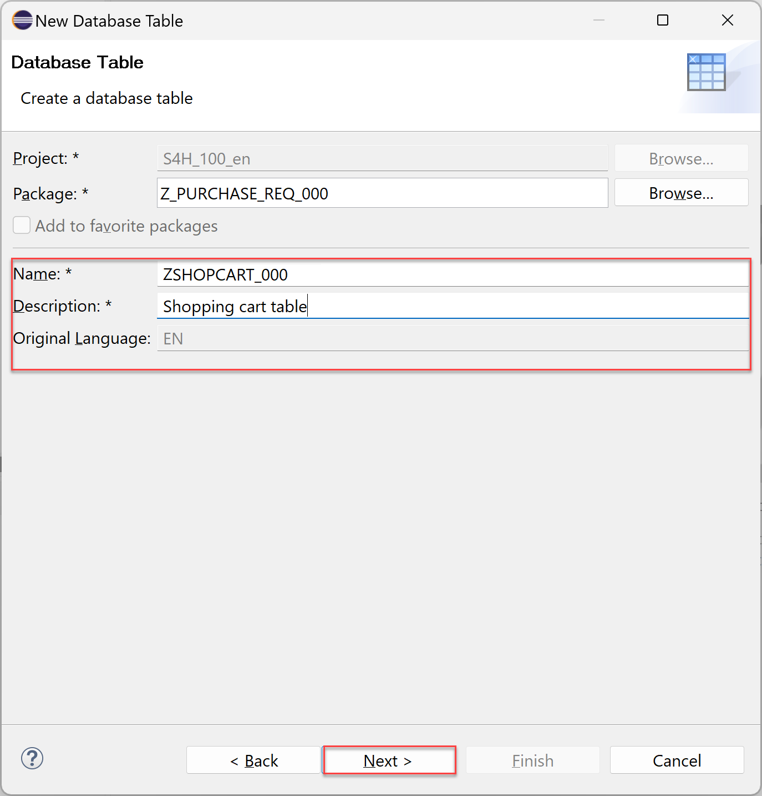
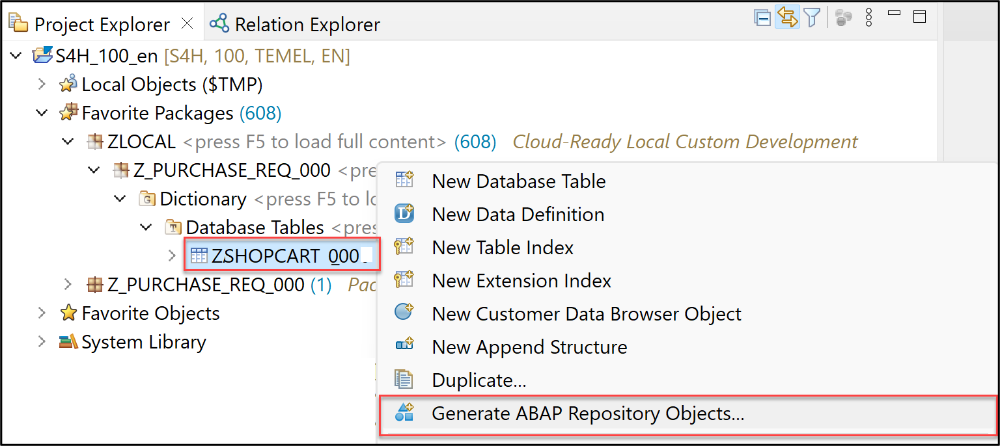
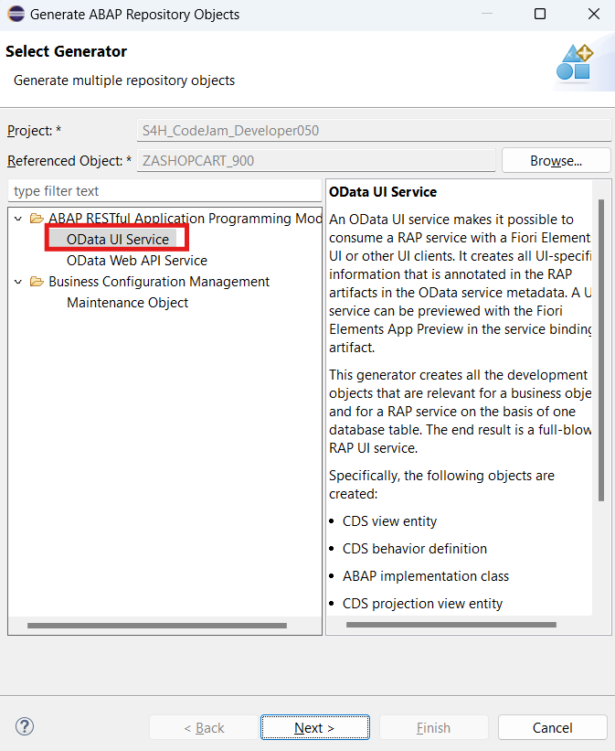
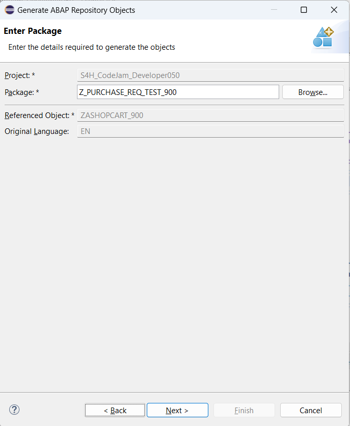
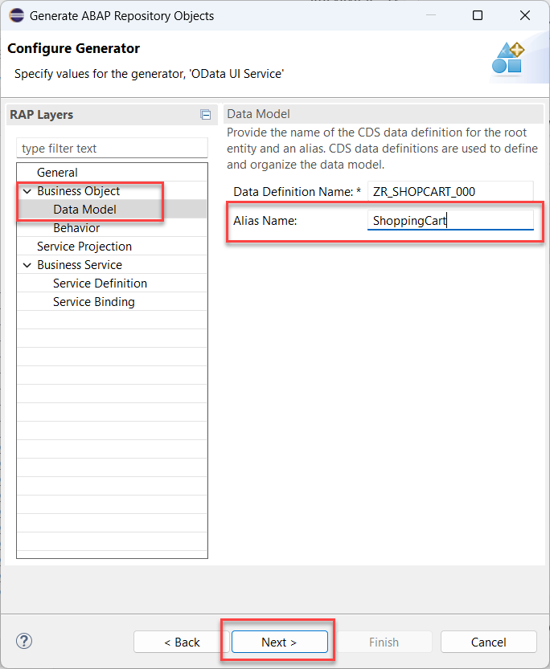
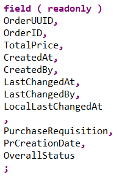

# Exercise 2: Create a Shopping Cart Business Object
<!-- description --> Create a shopping cart business object with SAP S/4HANA Cloud, ABAP Environment or SAP S/4HANA on-premise.

## Introduction
Now that you have generated a custom wrapper for the classic API `BAPI_PR_CREATE` for the creation of purchase requisition and released it for the ABAP Cloud development in [exercise 1](../ex1/README.md), you will now create your _Shopping Cart_ RAP business object and a UI service on top it.   

This RAP business object will then be enhanced later in Exercise 3 such, that a _purchase requisition_ will be created from the content of your _shopping cart_.

- [You will learn](#you-will-learn)
- [Summary & Next Exercise](#summary--next-exercise) 


## You will learn  
- How to create a database table
- How to generate a transactional UI service
- How to enhance the behavior definition of a data model 
- How to publish a service binding
- How to run the SAP Fiori Elements Preview
 
> **Reminder:**   
> Don't forget to replace all occurences of the placeholder **`###`** with your assigned group number in the exercise steps below.  
> You can use the ADT function **Replace All** (**Ctrl+F**) for the purpose.   
> If you don't have a group number, choose a 3-digit suffix and use it for all exercises.


## Step 1: Create database table

We start the creation of the RAP business object with creating a database table.   

<details>
  <summary>🔵 Click to expand</summary>

  1. Right-click your package **`Z_PURCHASE_REQ_###`** and select **New** > **Other ABAP Repository Object**.

      <!--  -->
      

  2. Search for **database table**, select it and click **Next >**.

      <!--  -->
      

  3. Create new database table:
     - Name: `ZSHOPCART_### `
     - Description: Shopping cart table

      <!--  -->
      

       Click **Next >**.

  4. Click **Finish**.

  5. Replace your code with following:
   
   ```
    @EndUserText.label : 'Shopping cart table'
    @AbapCatalog.enhancement.category : #NOT_EXTENSIBLE
    @AbapCatalog.tableCategory : #TRANSPARENT
    @AbapCatalog.deliveryClass : #A
    @AbapCatalog.dataMaintenance : #RESTRICTED
    define table zshopcart_### {
    key client            : abap.clnt not null;
    key order_uuid        : sysuuid_x16 not null;
    order_id              : abap.numc(8) not null;
    ordered_item          : abap.char(40) not null;
    @Semantics.amount.currencyCode : 'zshopcart_###.currency'
    price                 : abap.curr(11,2);
    @Semantics.amount.currencyCode : 'zshopcart_###.currency'
    total_price           : abap.curr(11,2);
    currency              : abap.cuky;
    order_quantity        : abap.numc(4);
    delivery_date         : abap.dats;
    overall_status        : abap.char(30);
    notes                 : abap.string(256);
    created_by            : abp_creation_user;
    created_at            : abp_creation_tstmpl;
    last_changed_by       : abp_lastchange_user;
    last_changed_at       : abp_lastchange_tstmpl;
    local_last_changed_at : abp_locinst_lastchange_tstmpl;
    purchase_requisition  : abap.char(10);
    pr_creation_date      : abap.dats;
    }
   ```
   
   6. Save and activate.

</details>

## Step 2: Generate a transactional UI service

You will now use a wizard to generate all repository objects required for your RAP business object based on the table you have just created.  

 <details>
  <summary>🔵 Click to expand</summary>


  1. Right-click your database table **`ZSHOPCART_###`** and select **Generate ABAP Repository Objects**.

      <!--  -->
      
  
  2. In the **Select Generator** screen choose the generator:    
     - Generator: **ABAP RESTful Application Programming Model: UI Service**

      <!--  -->
      

       Click **Next >**.

      > Please be aware that the screenshot above pertains to the SAP S/4HANA 2023 release.   

  3. In the **Enter Package** screen enter the name of your package **`Z_PURCHASE_REQ_###`** and click **Next >**.

     
 

  4. In the **Configure Generator** dialog navigate to the section **Business Object** and then click on **Data Model**.
     Here you have to provide the name of the alias.

     Alias Name: `ShoppingCart`    

     
    
  

     Verify the maintained entries and press **Next >** to confirm. The needed artifacts will be generated.


   | **RAP Layer**                          | **Artefacts**           | **Artefact Names**                                  |
   |----------------------------------------|-------------------------|-----------------------------------------------------|
   | **Business Object**                    |                         |                                                     |
   |                                        | **Data Model**          | Data Definition Name: **`ZR_SHOPCART_###`**     |
   |                                        |                         | Alias Name: **`ShoppingCart`**                        |  
   |                                        | **Behavior**            | Implementation Class: **`ZBP_R_SHOPCART_###`**    |
   |                                        |                         | Draft Table Name: **`ZSHOPCART_###_D`**            |  
   | **Service Projection (BO Projection)** |                         | Name: **`ZC_SHOPCART_###`**                     |
   | **Business Services**                  |                         |                                                     |
   |                                        | **Service Definition**  | Name: **`ZUI_SHOPCART_###_O4`**                      |
   |                                        | **Service Binding**     | Name: **`ZUI_SHOPCART_###_O4`**                   |
   |                                        |                         | Binding Type: **`OData V4 - UI`**                   |

     
<!--  -->


   Click **Next >**.

  5. Click **Finish**.

<!--  -->


</details>

## Step 3: Adapt the behavior definition of data model 

The generated code has to be adapted so that additional fields are made _read-only_.   

 <details>
  <summary>🔵 Click to expand</summary>
  
  1. Open your behavior definition **`ZR_SHOPCART_###`** to enhance it. Add the following read-only fields to your behavior definition:

   ```
    ,   
    PurchaseRequisition,   
    PrCreationDate,   
    OverallStatus;   
   ```
   
   <!--  -->
   

  2. Check your behavior definition:

<details>
  <summary>🟡📄 Click to expand and view and compare the source code!</summary>

   ```
managed implementation in class ZBP_R_SHOPCART_### unique;
strict ( 2 );
with draft;

define behavior for ZR_SHOPCART_### alias ShoppingCart
persistent table zshopcart_###
draft table zshopcart_###_d
etag master LocalLastChangedAt
lock master total etag LastChangedAt
authorization master ( global )

{
  field ( readonly )
  OrderUUID,
  CreatedAt,
  CreatedBy,
  LastChangedAt,
  LastChangedBy,
  LocalLastChangedAt
  ,
  PurchaseRequisition,
  PrCreationDate,
  OverallStatus;


  field ( numbering : managed )
  OrderUUID;


  create;
  update;
  delete;

  draft action Edit;
  draft action Activate optimized;
  draft action Discard;
  draft action Resume;
  draft determine action Prepare;

  mapping for zshopcart_###
    {
      OrderUUID           = order_uuid;
      OrderID             = order_id;
      OrderedItem         = ordered_item;
      Price               = price;
      TotalPrice          = total_price;
      Currency            = currency;
      OrderQuantity       = order_quantity;
      DeliveryDate        = delivery_date;
      OverallStatus       = overall_status;
      Notes               = notes;
      CreatedBy           = created_by;
      CreatedAt           = created_at;
      LastChangedBy       = last_changed_by;
      LastChangedAt       = last_changed_at;
      LocalLastChangedAt  = local_last_changed_at;
      PurchaseRequisition = purchase_requisition;
      PrCreationDate      = pr_creation_date;
    }
}  
   ```

</details>

   3. Save and activate.  
</details>

## Step 4: Publish service binding and run SAP Fiori Elements preview

What is left to do is to publish your service locally, so that it can be tested using the Fiori Elements preview.  

 <details>
  <summary>🔵 Click to expand</summary>
 
 
  1. Open your service binding **`ZUI_SHOPCART_###_O4`** and click **Publish**.
 
     
     

  2. Select **`ShoppingCart`** in your service binding and click **Preview** to open SAP Fiori Elements preview.

     > ⚠️ **Security Warning**      
     > Since the demo systems for workshops usually use just a public IP adress      
     > you will probably get a security warning at this point.   
     > In Edge for example click on **Advanced** and then on **Continue to xxx.xxx.xxx.xxx (unsafe)**    

     
     

</details>

## Summary & Next Exercise
[^Top of page](#)

Now that you've... 
- created an ABAP package in a software component with language version ABAP for Cloud Development(superpackage: `ZLOCAL`),
- created a database table to store the shopping cart data,
- generated a RAP BO and a transactional UI service,
- enhanced the behavior definition of a data model,
- published the service binding, and 
- ran the SAP Fiori Elements App Preview,

you can continue with the next exercise - **[Exercise 3 - Create Value Help, Enhance the Behavior Definition and Behavior Implementation of the Shopping Cart Business Object](../ex3/README.md)**.

---

