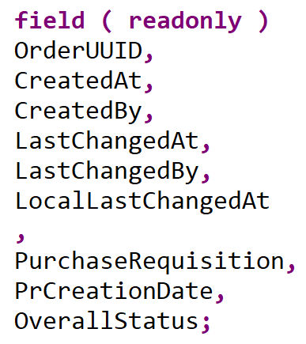

# Exercise 2: Create a Shopping Cart Business Object
<!-- description --> Create a shopping cart business object with SAP S/4HANA Cloud, ABAP Environment or SAP S/4HANA on-premise.
 
 <!--
## Prerequisites  
- This tutorial can be used in the SAP S/4HANA Public Cloud. This tutorial can also be used in both SAP S/4HANA Cloud, private edition system and SAP S/4HANA on-premise system with release 2022 FPS01, in which case you will need to import the [SAP Note 3330593](https://launchpad.support.sap.com/#/notes/3330593) and [SAP Note 3280851](https://me.sap.com/notes/3280851) in your system. We suggest using a [Fully-Activated Appliance] (https://blogs.sap.com/2018/12/12/sap-s4hana-fully-activated-appliance-create-your-sap-s4hana-1809-system-in-a-fraction-of-the-usual-setup-time/) in SAP Cloud Appliance Library for an easy start without the need for system setup.
- For SAP S/4HANA on-premise, create developer user with full development authorization 
- You have installed the latest [Eclipse with ADT](abap-install-adt).
- Use Starter Development Tenant in S/4HANA Cloud for the tutorial to have necessary sample data in place. See [3-System Landscape and Transport Management](https://help.sap.com/docs/SAP_S4HANA_CLOUD/a630d57fc5004c6383e7a81efee7a8bb/e022623ec1fc4d61abb398e411670200.html?state=DRAFT&version=2208.503).
- Business role `SAP_BR_PURCHASER` needs to be assigned to your business user
- In case the CAL instance is not used, please set up for developer extensibility to get `ZLOCAL` package.
 - Create software component for local cloud-ready development with `ZLOCAL`
 - Create a structure package with `ZLOCAL`
- You are already logged into SAP S/4HANA Cloud, ABAP Environment or SAP S/4HANA on-Premise.
-->

## Introduction
Now that you have implemented the wrapper for the unreleased SAP API **`BAPI_PR_CREATE`** and released it for the cloud development in [exercise 2](../ex2/README.md), you will now create your Shopping Cart RAP business object and a UI service on top it.


- [You will learn](#you-will-learn)
- [Summary & Next Exercise](#summary)  


## You will learn  
- How to create an ABAP package
- How to create a database table
- How to create transactional UI services
- How to enhance the behavior definition of a data model 
- How to publish a service binding
- How to run the SAP Fiori Elements Preview
 
> **Reminder:**   
> Don't forget to replace all occurences of the placeholder **`###`** with your assigned group number in the exercise steps below.  
> You can use the ADT function **Replace All** (**Ctrl+F**) for the purpose.   
> If you don't have a group number, choose a 3-digit suffix and use it for all exercises.


# Create ABAP package

**Hint:** In case the CAL instance is not used, please set up for developer extensibility to get `ZLOCAL` package.
 - Create software component for local cloud-ready development with `ZLOCAL`
 - Create a structure package with `ZLOCAL`


  1.  Select **ZLOCAL** > **New** > **ABAP Package**.

      <!--  -->
      

  2.  Create new **ABAP package**:
       - Name: **`Z_PURCHASE_REQ_###`**
       - Description: Package ###
       - Check **Add to favorite packages**

      <!--  -->
      

       Click **Next >**.

  3. Click **Next >**.

      <!--  -->
      


  4.  Create a new request:
      -  Request Description: TR12345

      <!--  -->
      

       Click **Finish**.


# Create database table

  1. Right-click your package `Z_PURCHASE_REQ_###` and select **New** > **Other ABAP Repository Object**.

      <!--  -->
      

  2. Search for **database table**, select it and click **Next >**.

      <!--  -->
      

  3. Create new database table:
     - Name: `ZASHOPCART_### `
     - Description: Shopping cart table

      <!--  -->
      

       Click **Next >**.

  4. Click **Finish**.

      <!--  -->
      

  5. Replace your code with following:
   
   ```
    @EndUserText.label : 'Shopping cart table'
    @AbapCatalog.enhancement.category : #NOT_EXTENSIBLE
    @AbapCatalog.tableCategory : #TRANSPARENT
    @AbapCatalog.deliveryClass : #A
    @AbapCatalog.dataMaintenance : #RESTRICTED
    define table zashopcart_### {
    key client            : abap.clnt not null;
    key order_uuid        : sysuuid_x16 not null;
    order_id              : abap.numc(8) not null;
    ordered_item          : abap.char(40) not null;
    @Semantics.amount.currencyCode : 'zashopcart_###.currency'
    price                 : abap.curr(11,2);
    @Semantics.amount.currencyCode : 'zashopcart_###.currency'
    total_price           : abap.curr(11,2);
    currency              : abap.cuky;
    order_quantity        : abap.numc(4);
    delivery_date         : abap.dats;
    overall_status        : abap.char(30);
    notes                 : abap.string(256);
    created_by            : abp_creation_user;
    created_at            : abp_creation_tstmpl;
    last_changed_by       : abp_lastchange_user;
    last_changed_at       : abp_lastchange_tstmpl;
    local_last_changed_at : abp_locinst_lastchange_tstmpl;
    purchase_requisition  : abap.char(10);
    pr_creation_date      : abap.dats;
    }
   ```
   
   6. Save and activate.


# Generate transactional UI services


  1. Right-click your database table `ZASHOPCART_###` and select **Generate ABAP Repository Objects**.

      <!--  -->
      

  2. Create new **ABAP repository object**:
     - Generator: **ABAP RESTful Application Programming Model: UI Service**

      <!--  -->
      

       Click **Next >**.

      > Please be aware that the screenshot above pertains to the SAP S/4HANA 2022 release. In the SAP S/4HANA 2023 release the wizard looks slightly different: you will first select the **Generator** and in the following wizard page you will see the Package information.

  3. Maintain the required information on the **Configure Generator** dialog to provide the name of your data model and generate them.         
     
     For that, navigate through the wizard tree **(Business Objects, Data Model, etc...)**, maintain the artefact names provided in the table below, and press **Next >**.

     Verify the maintained entries and press **Next >** to confirm. The needed artifacts will be generated.

     **Please note**: Error Invalid XML format.   
     If you receive an error message **Invalid XML format of the response**, this may be due to a bug in version 1.26 of the ADT tools. An update of your ADT plugin to version 1.26.3 will fix this issue.

   | **RAP Layer**                          | **Artefacts**           | **Artefact Names**                                  |
   |----------------------------------------|-------------------------|-----------------------------------------------------|
   | **Business Object**                    |                         |                                                     |
   |                                        | **Data Model**          | Data Definition Name: **`ZR_SHOPCARTTP_###`**     |
   |                                        |                         | Alias Name: **`ShoppingCart`**                        |  
   |                                        | **Behavior**            | Implementation Class: **`ZBP_SHOPCARTTP_###`**    |
   |                                        |                         | Draft Table Name: **`ZDSHOPCART_###`**            |  
   | **Service Projection (BO Projection)** |                         | Name: **`ZC_SHOPCARTTP_###`**                     |
   | **Business Services**                  |                         |                                                     |
   |                                        | **Service Definition**  | Name: **`ZUI_SHOPCART_###`**                      |
   |                                        | **Service Binding**     | Name: **`ZUI_SHOPCART_O4_###`**                   |
   |                                        |                         | Binding Type: **`OData V4 - UI`**                   |

<!--  -->


   Click **Next >**.

  4. Click **Finish**.

<!--  -->


# Enhance behavior definition of data model

**In this tutorial example a SAP S/4HANA Cloud, ABAP environment system was used. The mode therefore is `strict (2)`.**
  
  1. Open your behavior definition **`ZR_SHOPCARTTP_###`** to enhance it. Add the following read-only fields to your behavior definition:

   ```
    ,
    PurchaseRequisition,
    PrCreationDate,
    DeliveryDate;
   ```
   
    <!--  -->
    

  2. Check your behavior definition:

<details>
  <summary>🟡📄 Click to expand and view or copy the source code!</summary>

   ```
    managed implementation in class ZBP_SHOPCARTTP_### unique;
    strict ( 2 );
    with draft;

    define behavior for ZR_SHOPCARTTP_### alias ShoppingCart
    persistent table zashopcart_###
    draft table ZDSHOPCART_###
    etag master LocalLastChangedAt
    lock master total etag LastChangedAt
    authorization master( global )

    {
    field ( readonly )
       OrderUUID,
       CreatedAt,
       CreatedBy,
       LastChangedAt,
       LastChangedBy,
       LocalLastChangedAt,
       PurchaseRequisition,
       PrCreationDate,
       DeliveryDate;

    field ( numbering : managed )
       OrderUUID;


    create;
    update;
    delete;

    draft action Edit;
    draft action Activate;
    draft action Discard;
    draft action Resume;
    draft determine action Prepare;

    mapping for ZASHOPCART_###
    {
       OrderUUID = ORDER_UUID;
       OrderID = ORDER_ID;
       OrderedItem = ORDERED_ITEM;
       Price = PRICE;
       TotalPrice = TOTAL_PRICE;
       Currency = CURRENCY;
       OrderQuantity = ORDER_QUANTITY;
       DeliveryDate = DELIVERY_DATE;
       OverallStatus = OVERALL_STATUS;
       Notes = NOTES;
       CreatedBy = CREATED_BY;
       CreatedAt = CREATED_AT;
       LastChangedBy = LAST_CHANGED_BY;
       LastChangedAt = LAST_CHANGED_AT;
       LocalLastChangedAt = LOCAL_LAST_CHANGED_AT;
       PurchaseRequisition = PURCHASE_REQUISITION;
       PrCreationDate = PR_CREATION_DATE;
    }
    }    
   ```

</details>

   3. Save and activate.  


# Publish service binding and run SAP Fiori Elements preview

Choose between the tabs **Cloud** and **On-premise** and follow the publishing process.

 <details>
  <summary>🔵 Click to expand *[OPTION Cloud]*!</summary>
 
 [OPTION BEGIN [Cloud]]
 
  1. Open your service binding **`ZUI_SHOPCART_O4_###`** and click **Publish**.

     
     

  2. Select **`ShoppingCart`** in your service binding and click **Preview** to open SAP Fiori Elements preview.

     
     

[OPTION END]
  </details>
  
  <details>
  <summary>🔵 Click to expand *[OPTION On-Premise]*!</summary>
  
[OPTION BEGIN [On-premise]] 

  1. Login to **SAP NetWeaver** and execute `/n/IWFND/V4_ADMIN` `t-code`.

     <!--  -->
     

  2. Click on **Publish Service Groups**.

     <!--  -->
     

  3. Select **System Alias** and click **Get Service Groups**. Select the Service Group **`ZUI_SHOPCART_O4_###`** and click **Publish Service Groups**.

    <!--  -->
     

  4. Click **Continue**, you will get the message **New service group(s) successfully published**.
    
     <!--  -->
     

  5. Click the back button to see the published group.

  6. Expand the **Service Groups** and double click on the group.

      <!--  -->
      

  7. We can see the available services under this group.

  8. To test the service, go back to your service binding, select **`ShoppingCart`** to start the SAP Fiori Elements preview.

      <!-- .
  
[OPTION END]
</details>

# Summary 
[^Top of page](#)

Now that you've... 
- created an ABAP package on tier 1 (superpackage: ZLOCAL),
- created a database table to store the shopping cart data,
- generated a RAP BO and a transactional UI service,
- enhanced the behavior definition of a data model,
- published the service binding, and 
- ran the SAP Fiori Elements App Preview,

you can continue with the next exercise - **[Exercise 3 - Create Value Help, Enhance the Behavior Definition and Behavior Implementation of the Shopping Cart Business Object](../ex3/README.md)**.

---

