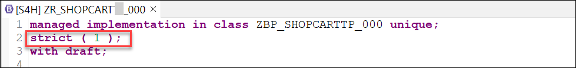
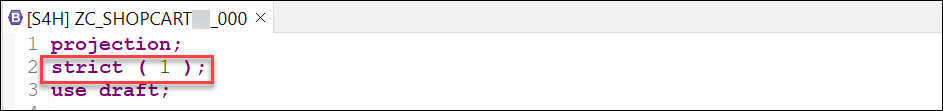
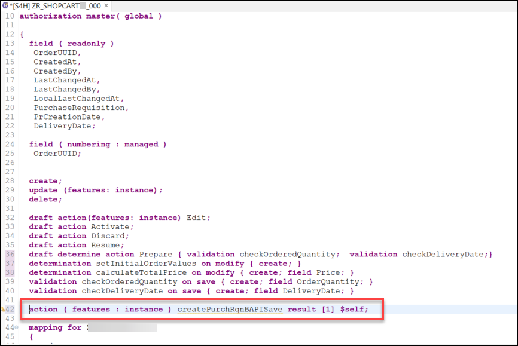
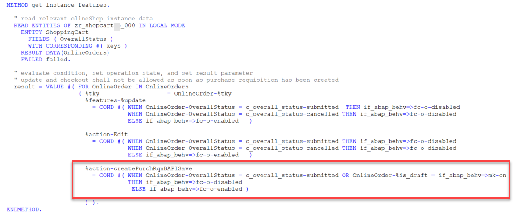
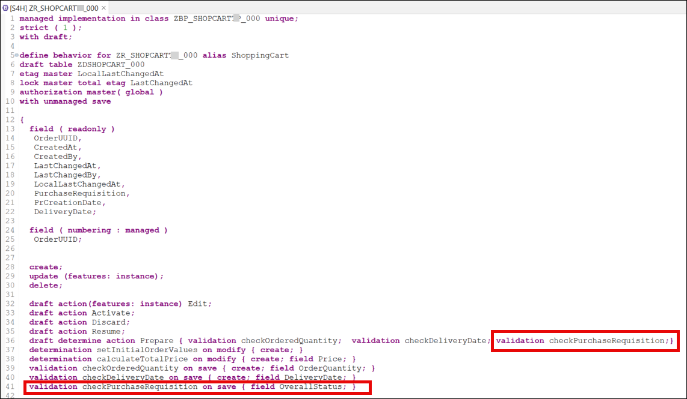
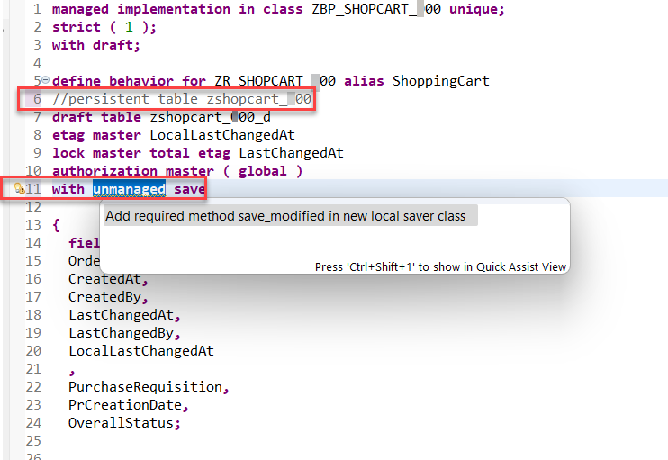

# Exercise 4: Integrate the Wrapper into the Shopping Cart Business Object
<!-- description --> Learn how to integrate your wrapper in a RAP BO, implement a new action to call the wrapper during the save sequence phase and expose it via service binding

## Introduction

Now that you've enhanced the RAP BO data model, behavior definition, and behavior implementation in [exercise 3](../ex3/README.md), you will learn in the present exercise how to integrate a custom wrapper into a RAP BO and implement a new action to call the custom wrapper during the save sequence phase of the RAP BO. You will also learn how to expose an action via the service binding. 

<!--
## Intro
>Throughout this tutorial, wherever ### appears, use a number (e.g. 000). This tutorial is done with the placeholder 000.

In this tutorial you will take the wrapper that you created and you will integrate it in your shopping cart RAP Business Object (RAP BO) to create purchase requisitions in your online shop application as indicated in the [Using BAPIs in RAP](https://blogs.sap.com/2022/11/30/using-bapis-in-rap/) blog post:

- You will implement a new action. The action shall change the status of the business object instance to "Submitted".
- You will implement a validation for the status. When the status is "Submitted", the validation will call the BAPI in test mode via the wrapper. It will return any error message raised by the BAPI. These error messages are then returned to the end user.
- You will adapt the RAP BO and turn it into a RAP BO with unmanaged save. In the corresponding `save_modified` method implementation, when the status of a business object instance is "Submitted", the wrapper will be called via the BAPI and a purchase requisition is created for that business object instance.

-->


- [You will learn](#you-will-learn)
- [Summary & Next Exercise](#summary--next-exercise)  


## You will learn
- How to integrate a wrapper class in a RAP BO during the save sequence
- How to implement a new action in RAP BO to call the wrapper class and use it to create a purchase requisition
- How to expose the action via service binding

> **Reminder:**   
> Don't forget to replace all occurences of the placeholder **`###`** with your assigned group number in the exercise steps below.  
> You can use the ADT function **Replace All** (**Ctrl+F**) for the purpose.   
> If you don't have a group number, choose a 3-digit suffix and use it for all exercises.

## Step 1: Switch to strict (1) mode

Later in this tutorial we will implement a `save_modified` method in the RAP Business Object, which will invoke authorization checks during the save sequence. If the RAP behavior definition is implemented in ABAP for Cloud Development and the `strict(2)` mode is applied, this would lead to runtime errors. 

For this reason, we will switch to `strict(1)` mode. For more information, see [The RAP Transactional Model and the SAP LUW](https://help.sap.com/docs/abap-cloud/abap-rap/rap-transactional-model-and-sap-luw).

<details>
  <summary>🔵 Click to expand</summary>
  
Connect to your system via ADT and navigate to the package `Z_PURCHASE_REQ_###` containing the RAP BO.   
Open the behavior definition `ZR_SHOPCART_###` and change to `strict(1)` mode:   



Save and activate it.

Open the behavior definition `ZC_SHOPCART_###` and change to `strict(1)` mode there as well:



Save and activate it.

</details>

## Step 2: Implement new action `createPurchRqnBAPISave`

You will now create a whole new action in the RAP BO, called `createPurchRqnBAPISave`. Open the behavior definition `ZR_SHOPCART_###` and define a new action with the following code snippet:

<details>
  <summary>🔵 Click to expand</summary>
  
```ABAP
  action ( features : instance ) createPurchRqnBAPISave result [1] $self;

```

Your behavior definition should look as follows:



Save and activate it.

Position the cursor on the newly defined action and use the shortcut `ctrl + 1` to load the quick assist proposals, then double-click on `add method for action createPurchRqnBAPISave of entity zr_shopcart_### in local class lhc_shopcart`. 

This will automatically create an empty method implementation in the `lhc_shopcart` class. Implement the method as follows:

``` ABAP
  METHOD createPurchRqnBAPISave.
  "read transfered order instances
  READ ENTITIES OF zr_shopcart_### IN LOCAL MODE
    ENTITY ShoppingCart
      ALL FIELDS WITH
      CORRESPONDING #( keys )
    RESULT DATA(OnlineOrders).
 
  MODIFY ENTITIES OF zr_shopcart_### IN LOCAL MODE
     ENTITY ShoppingCart
        UPDATE FIELDS ( OverallStatus )
           WITH VALUE #( FOR key IN keys (
            OrderUUID = key-OrderUUID
            OverallStatus = c_overall_status-submitted
         ) ).
 
  "Read the changed data for action result
  READ ENTITIES OF zr_shopcart_### IN LOCAL MODE
    ENTITY ShoppingCart
      ALL FIELDS WITH
      CORRESPONDING #( keys )
    RESULT DATA(result_read).
  "return result entities
  result = VALUE #( FOR result_order IN result_read ( %tky   = result_order-%tky
                                                      %param = result_order ) ).
  ENDMETHOD.

```

Save and activate it.

This action will mark the orders where purchase requisition shall be created using the `OverallStatus` field. In a later step we will create the `save_modified` implementation and adapt it to use this `OverallStatus` field to filter the orders where purchase requisition shall be created. 
As a result, when the button for this action is clicked in the UI, a new purchase requisition will be created for the selected entity via the wrapper class.

You now need to adapt the `get_instance_features` method in the `lhc_shopcart` class of the behavior implementation by adding the following code snippet:

```ABAP
%action-createPurchRqnBAPISave
= COND #( WHEN OnlineOrder-OverallStatus = c_overall_status-submitted OR OnlineOrder-%is_draft = if_abap_behv=>mk-on
          THEN if_abap_behv=>fc-o-disabled
          ELSE if_abap_behv=>fc-o-enabled )
```

So the method implementation now looks as follows:



Save and activate it.

</details>

## Step 3: Implement on save validation using the BAPI test mode

As seen in the previous tutorial of this series, certain BAPIs have a test mode that can be used to validate the input data. Depending on the type of BAPI, how you plan to integrate it in your RAP BO and your specific use case, it is recommended to use this test mode as a validation in your RAP BO. So, after the action `createPurchRqnBAPISave` is called, this validation can be used to check the input data (before the logic moves on to the `save_modified` step, where the entity is modified and the purchase requisition is created).

<details>
  <summary>🔵 Click to expand</summary>
  
Open the behavior definition `ZR_SHOPCART_###` and implement a new validation called `checkPurchaseRequisition`:

Add the following statement so that the validation will be executed also in draft mode.  

```ABAP
  draft determine action Prepare { validation checkOrderedQuantity; validation checkDeliveryDate; validation checkPurchaseRequisition;}
```

And add the following code to define the new validation (see also screen shot below).      
```ABAP  
  validation checkPurchaseRequisition on save { field OverallStatus; }
```



Save and activate it. Then place the cursor on the newly created validation and use the shortcut `ctrl + 1` to load the quick assist proposals, then double-click on `Add method for validation checkpurchaserequisition of entity zr_shopcarttp_### in local class lhc_shopcart` and implement the method as follows:

<details>
  <summary>🟡📄 Click to expand and view or copy the source code!</summary>  
  
``` ABAP
  METHOD checkpurchaserequisition.

    DATA prheader TYPE zif_wrap_bapi_pr_###=>bapimereqheader .
    DATA prheaderx TYPE zif_wrap_bapi_pr_###=>bapimereqheaderx .
    DATA number  TYPE zif_wrap_bapi_pr_###=>banfn  .
    DATA pritem  TYPE zif_wrap_bapi_pr_###=>_bapimereqitemimp .
    DATA pritemx  TYPE zif_wrap_bapi_pr_###=>_bapimereqitemx  .
    DATA prheaderexp  TYPE zif_wrap_bapi_pr_###=>bapimereqheader .
    DATA  return  TYPE zif_wrap_bapi_pr_###=>_bapiret2 .

    "read relevant order instance data
    READ ENTITIES OF zr_shopcart_### IN LOCAL MODE
      ENTITY ShoppingCart
        ALL FIELDS WITH
        CORRESPONDING #( keys )
      RESULT DATA(OnlineOrders).

    prheader = VALUE #( pr_type = 'NB' ).
    prheaderx = VALUE #( pr_type = 'X' ).

    LOOP AT OnlineOrders INTO DATA(OnlineOrder) WHERE OverallStatus = c_overall_status-submitted.

      pritem           = VALUE #( (
                           preq_item  = '00010'
                           plant      = '1010'
                           acctasscat = 'U'
                           currency   = OnlineOrder-Currency
                           deliv_date = OnlineOrder-DeliveryDate
                           material    = OnlineOrder-OrderedItem "'ZPRINTER01'
                           matl_group  = 'L001'
                           preq_price = OnlineOrder-Price
                           quantity   = OnlineOrder-OrderQuantity
                           unit       = 'ST'
                           pur_group = '001'
                           purch_org = '1010'
                           short_text =  OnlineOrder-OrderedItem
                         ) ).

      pritemx           = VALUE #( (
                        preq_item  = '00010'
                        plant      = 'X'
                        acctasscat = 'X'
                        currency   = 'X'
                        deliv_date = 'X'
                        material   = 'X'
                        matl_group = 'X'
                        preq_price = 'X'
                        quantity   = 'X'
                        unit       = 'X'
                        pur_group = 'X'
                        purch_org = 'X'
                        short_text = 'X'
                      ) ).


      zcl_f_wrap_bapi_pr_###=>create_instance( )->bapi_pr_create(  
          EXPORTING
            prheader = prheader
            prheaderx = prheaderx
            testrun = abap_true
          IMPORTING
            number   = number
            prheaderexp = prheaderexp
          CHANGING
            pritem          = pritem
            pritemx         = pritemx
            return          = return
            )
        .

      LOOP AT return INTO DATA(pr_return_msg) WHERE type = 'E' OR type = 'W'.
        APPEND VALUE #(
          orderuuid = OnlineOrder-OrderUUID
          %msg = new_message(
                        id        = pr_return_msg-id
                        number    = pr_return_msg-number
                        severity  = COND #( WHEN pr_return_msg-type = 'E' THEN if_abap_behv_message=>severity-error
                                            WHEN pr_return_msg-type = 'W' THEN if_abap_behv_message=>severity-warning
                                             )
                         v1 = pr_return_msg-message_v1
                         v2 = pr_return_msg-message_v2
                         v3 = pr_return_msg-message_v3
                         v4 = pr_return_msg-message_v4  )
          %element-purchaserequisition = if_abap_behv=>mk-on
          %action-createPurchRqnBAPISave = if_abap_behv=>mk-on
           ) TO reported-shoppingcart.

        APPEND VALUE #(
         orderuuid = OnlineOrder-OrderUUID
         %fail = VALUE #( cause = if_abap_behv=>cause-unspecific )
        ) TO failed-shoppingcart.
      ENDLOOP.
    ENDLOOP.

  ENDMETHOD.
```
</details>

The method reads the entities of the RAP BO, checks the entries and triggers the BAPI test mode call for those orders where a purchase requisition is being created. The method also takes care of error handling: it filters for any error or warning raised from the BAPI call and passes it on to the UI which would display a pop-up error message if needed.

Save it and activate it.

> **Brief explanantion**:     
> The parameter `FOR VALIDATE ON SAVE` means that the method will be used during the save sequence of the RAP BO. Which means that after the creation of a new entry, when the user will save it, this method will be called to check the validity of the input data.
> 
> For the scope of this tutorial, we will use the material `ZPRINTER01`, which is automatically available in any [Fully-Activated Appliance](https://blogs.sap.com/2018/12/12/sap-s4hana-fully-activated-appliance-create-your-sap-s4hana-1809-system-in-a-fraction-of-the-usual-setup-time/) in SAP Cloud Appliance Library. If you are using a different system, you might have to create a material to use in the tutorial (see [Creating Materials](https://help.sap.com/docs/SAP_S4HANA_ON-PREMISE/f7fddfe4caca43dd967ac4c9ce6a70e4/23d6b8535c39b44ce10000000a174cb4.html?version=2022.000)).

</details>

## Step 4: Implement `unmanaged_save`

In our scenario, we want to call the wrapper during the save sequence and therefore we need to switch to a RAP BO with unmanaged save, so that we can implement and adapt the `save_modified` method and call the wrapper therein.

<details>
  <summary>🔵 Click to expand</summary>
  
Open the behavior definition `ZR_SHOPCART_###`, **delete** or **comment out** the following line:

```ABAP
//persistent table zshopcart_### 
```
and **add** the unmanaged save statement:

```ABAP
with unmanaged save

```



Save and activate it. Position the cursor on the `with unmanaged save` statement and use the shortcut `ctrl + 1` to load the quick assist proposals, then double-click on `Add required method save_modified in new local saver class` to automatically create an empty implementation for the method. Implement it as follows:

```ABAP
  METHOD save_modified.

    IF create-shoppingcart IS NOT INITIAL.
      INSERT zshopcart_### FROM TABLE @create-shoppingcart  MAPPING FROM ENTITY .
    ENDIF.

    IF update IS NOT INITIAL.
      UPDATE zshopcart_### FROM TABLE @update-shoppingcart
         INDICATORS SET STRUCTURE %control MAPPING FROM ENTITY.
    ENDIF.

    LOOP AT delete-shoppingcart INTO DATA(shoppingcart_delete) WHERE OrderUUID IS NOT INITIAL.
      DELETE FROM zshopcart_### WHERE order_uuid = @shoppingcart_delete-OrderUUID.
      DELETE FROM zshopcart_###_d WHERE orderuuid = @shoppingcart_delete-OrderUUID.
    ENDLOOP.
  ENDMETHOD.

```

Save and activate it.

> **Brief explanantion**:      
> We use the unmanaged save option for our scenario, rather than the additional save option. This is because the additional save should only be used in case data needs to be saved in addition to BO data in a persistence outside the BO, as stated in the [Additional Save documentation](https://help.sap.com/docs/SAP_S4HANA_CLOUD/e5522a8a7b174979913c99268bc03f1a/ca7097c8ea404b11b1f1334fd54cdd15.html). Since this is not our use case (the purchase requisition is created and saved in the persistency of the shopping cart BO), we rely on the unmanaged save option.

</details>

## Step 5: Call wrapper class in unmanaged save implementation `save_modified`

As a final step, you now need to modify the `save_modified` method of the saver class, so that it calls the wrapper class (which creates the purchase requisition).

<details>
  <summary>🔵 Click to expand</summary>
  
Open the `lsc_zr_shopcarttp_###` class of the behavior implementation and navigate to the `save_modified` method. Add the following code snippet:

```ABAP

DATA : prheader    TYPE zif_wrap_bapi_pr_000=>bapimereqheader,
           prheaderx   TYPE zif_wrap_bapi_pr_000=>bapimereqheaderx,
           number      TYPE zif_wrap_bapi_pr_000=>banfn,
           pritem      TYPE zif_wrap_bapi_pr_000=>_bapimereqitemimp,
           pritemx     TYPE zif_wrap_bapi_pr_000=>_bapimereqitemx,
           prheaderexp TYPE zif_wrap_bapi_pr_000=>bapimereqheader,
           pr_return   TYPE zif_wrap_bapi_pr_000=>_bapiret2.

    prheader = VALUE #( pr_type = 'NB' ).
    prheaderx = VALUE #( pr_type = 'X' ).

    IF update IS NOT INITIAL.
      LOOP AT update-shoppingcart INTO DATA(OnlineOrder) WHERE %control-OverallStatus = if_abap_behv=>mk-on.

        pritem           = VALUE #( (
                              preq_item  = '00010'
                              plant      = '1010'
                              acctasscat = 'U'
                              currency   = OnlineOrder-Currency
                              deliv_date  = OnlineOrder-DeliveryDate
                              material    = 'ZPRINTER01'
                              matl_group  = 'A001'
                              preq_price  = OnlineOrder-Price
                              quantity    = OnlineOrder-OrderQuantity
                              unit        = 'ST'
                              pur_group   = '001'
                              purch_org   = '1010'
                              short_text = OnlineOrder-OrderedItem
                            ) ).

        pritemx           = VALUE #( (
                          preq_item  = '00010'
                          plant      = 'X'
                          acctasscat = 'X'
                          currency   = 'X'
                          deliv_date = 'X'
                          material   = 'X'
                          matl_group = 'X'
                          preq_price = 'X'
                          quantity   = 'X'
                          unit       = 'X'
                          pur_group  = 'X'
                          purch_org  = 'X'
                          short_text = 'X'
                        ) ).


        DATA(myclass) = zcl_f_wrap_bapi_pr_000=>create_instance( ).

        myclass->bapi_pr_create(
          EXPORTING
            prheader    = prheader
            prheaderx   = prheaderx
            testrun     = abap_false
          IMPORTING
            number      = number
            prheaderexp = prheaderexp
          CHANGING
            pritem      = pritem
            pritemx     = pritemx
            return      = pr_return
          ).

        ASSERT NOT line_exists( pr_return[ type = 'E' ] ).

        DATA(creation_date) = cl_abap_context_info=>get_system_date(  ).

        UPDATE zshopcart_000
        SET purchase_requisition = @number,
            pr_creation_date = @creation_date
        WHERE order_uuid = @OnlineOrder-OrderUUID.

      ENDLOOP.
    ENDIF.

```

The `save_modified` method implementation should now look as follows:

<details>
  <summary>🟡📄 Click to expand and view or copy the source code!</summary>  

```ABAP
  METHOD save_modified.

    IF create-shoppingcart IS NOT INITIAL.
      INSERT zshopcart_### FROM TABLE @create-shoppingcart  MAPPING FROM ENTITY .
    ENDIF.

    IF update IS NOT INITIAL.
      UPDATE zshopcart_### FROM TABLE @update-shoppingcart
         INDICATORS SET STRUCTURE %control MAPPING FROM ENTITY.
    ENDIF.

    LOOP AT delete-shoppingcart INTO DATA(shoppingcart_delete) WHERE OrderUUID IS NOT INITIAL.
      DELETE FROM zshopcart_### WHERE order_uuid = @shoppingcart_delete-OrderUUID.
      DELETE FROM zshopcart_###_d WHERE orderuuid = @shoppingcart_delete-OrderUUID.
    ENDLOOP.


    DATA : prheader    TYPE zif_wrap_bapi_pr_###=>bapimereqheader,
           prheaderx   TYPE zif_wrap_bapi_pr_###=>bapimereqheaderx,
           number      TYPE zif_wrap_bapi_pr_###=>banfn,
           pritem      TYPE zif_wrap_bapi_pr_###=>_bapimereqitemimp,
           pritemx     TYPE zif_wrap_bapi_pr_###=>_bapimereqitemx,
           prheaderexp TYPE zif_wrap_bapi_pr_###=>bapimereqheader,
           pr_return   TYPE zif_wrap_bapi_pr_###=>_bapiret2.

    prheader = VALUE #( pr_type = 'NB' ).
    prheaderx = VALUE #( pr_type = 'X' ).

    IF update IS NOT INITIAL.
      LOOP AT update-shoppingcart INTO DATA(OnlineOrder) WHERE %control-OverallStatus = if_abap_behv=>mk-on.

        pritem           = VALUE #( (
                              preq_item  = '###10'
                              plant      = '1010'
                              acctasscat = 'U'
                              currency   = OnlineOrder-Currency
                              deliv_date  = OnlineOrder-DeliveryDate
                              material    = 'ZPRINTER01'
                              matl_group  = 'A001'
                              preq_price  = OnlineOrder-Price
                              quantity    = OnlineOrder-OrderQuantity
                              unit        = 'ST'
                              pur_group   = '001'
                              purch_org   = '1010'
                              short_text = OnlineOrder-OrderedItem
                            ) ).

        pritemx           = VALUE #( (
                          preq_item  = '###10'
                          plant      = 'X'
                          acctasscat = 'X'
                          currency   = 'X'
                          deliv_date = 'X'
                          material   = 'X'
                          matl_group = 'X'
                          preq_price = 'X'
                          quantity   = 'X'
                          unit       = 'X'
                          pur_group  = 'X'
                          purch_org  = 'X'
                          short_text = 'X'
                        ) ).


        DATA(myclass) = zcl_f_wrap_bapi_pr_###=>create_instance( ).

        myclass->bapi_pr_create(
          EXPORTING
            prheader    = prheader
            prheaderx   = prheaderx
            testrun     = abap_false
          IMPORTING
            number      = number
            prheaderexp = prheaderexp
          CHANGING
            pritem      = pritem
            pritemx     = pritemx
            return      = pr_return
          ).

        ASSERT NOT line_exists( pr_return[ type = 'E' ] ).

        DATA(creation_date) = cl_abap_context_info=>get_system_date(  ).

        UPDATE zshopcart_###
        SET purchase_requisition = @number,
            pr_creation_date = @creation_date
        WHERE order_uuid = @OnlineOrder-OrderUUID.

      ENDLOOP.
    ENDIF.


  ENDMETHOD.

```
</details>

Save and activate it.

The logic is now fully implemented: when the new action is used, shopping cart orders are marked (similar to a checkbox) using the `OverallStatus` field, they are subsequently validated for purchase requisition creation and then used to create the actual purchase requisition in the unmanaged save implementation in the `save_modified` method.
  
> **Brief explanantion**:      
> The BAPI wrapper call is implemented in the unmanaged save implementation `save_modified`, and not directly in the action implementation. The reason is for transactional consistency: during the BAPI call a `CALL FUNCTION IN UPDATE TASK` happens, and the update task is not allowed in the interaction phase or early-save phase and leads to a runtime error.
>
> You might notice that the `save_modified` now has two `IF update IS NOT INITIAL` sections, one from the original behavior implementation from the previous step (which is representative of a standard save sequence implementation for the `save_modified` method), and the new one we just implemented (which calls the wrapper to create a purchase requisition during the save sequence). This is not strictly necessary, and the logic could be combined, but for the sake of clarity and modularity we decided to keep it separated for this tutorial series (even if it is slightly redundant).
>
> Given our implementation, there is no way to handle errors at this phase, so the `ASSERT` statement is used as a contingency: it catches any error that was not caught during the validation phase and leads to a runtime error.

</details>

## Step 6: Expose the new action

You will now expose the newly created action. To do this, you will modify the *Metadata Extension* and the *Behavior Projection* to expose the action.

<details>
  <summary>🔵 Click to expand</summary>
  
Open the Metadata Extension `ZC_SHOPCART_###` and substitute all the metadata content referring to the action `PurchaseRequisition` with the following code snippet referring to the new action:

```ABAP
  @UI.lineItem: [ {
    position: 70 ,
    label: 'Purchase requisition number',
    importance: #HIGH
  },

  { type: #FOR_ACTION, dataAction: 'createPurchRqnBAPISave', label: 'Create PR via BAPI in SAVE' } ]
  @UI.identification: [ { position: 70, label: 'Purchase Requisition Number' } , { type: #FOR_ACTION, dataAction: 'createPurchRqnBAPISave', label: 'Create PR via BAPI in SAVE' } ]
  PurchaseRequisition;
```

Your metadata implementation should look like this:


Save and activate it.

Open the Behavior Definition `ZC_SHOPCART_###` and expose the new action with the code snippet:

```ABAP
  use action createPurchRqnBAPISave;
``` 

The Behavior Definition should now look as follows:

```ABAP
  projection;
  strict ( 1 );
  use draft;
  use side effects;  

  define behavior for ZC_SHOPCART_### alias ShoppingCart
  use etag

  {
    use create;
    use update;
    use delete;

    use action Edit;
    use action Activate;
    use action Discard;
    use action Resume;
    use action Prepare;

    use action createPurchRqnBAPISave;
  }
``` 

Save and activate it.

</details>

## Step 7: Run SAP Fiori Elements Preview to test action

Preview the enhanced _Shopping Cart_ app.

<details>
  <summary>🔵 Click to expand</summary>
  
In ADT, open the Service Binding `ZUI_SHOPCART_O4_###` and click on the **Preview** button to start a preview of the UI of your RAP BO. You will be prompted to login. Create a new entry and then click on the button `Create PR via BAPI in SAVE` to create the purchase requisition:


The purchase requisition will be created:


</details>

## Step 8: Check the results in the SAP standard `Purchase Requisition - Professional` App

You can  use the app **Manage Purchase Requisition - Professional** to check the purchase requistions that you have created using your custom _shopping cart_ RAP BO.   

<details>
  <summary>🔵 Click to expand</summary>
  
  1. In a preconfigured appliance system, the standard **Manage Purchase Requisition - Professional** app can be started using the ABAP Fiori Launchpad using the following URL, where you will replace `xxx.xxx.xxx.xxx` with your assigned system IP address:     
  
     https://xxx.xxx.xxx.xxx:44301/sap/bc/ui2/flp?sap-client=100&sap-language=EN#PurchaseRequisition-maintain
    
     > **Hint:** Alternatively, you can launch the ABAP Fiori launchpad using the transaction code **`/ui2/flp`** (`/n/ui2/flp`) and then search for the app *Manage Purchase Requisition - Professional*.

     **Manage Purchase Requistion - SAP standard application**   
       
    
     Now you can search for the created purchase requisition number.

     > **Note**
     > Before checking the results in the ADT Fiori Elements preview make sure to clear the cache by pressing **F12** and by selecting **clear cache and refresh**. Otherwise you might run into the issue that the button 
       of the action is visible but not functional.   

</details>

## Summary & Next Exercise
[^Top of page](#)

Now that you've... 
- integrated a wrapper class in a RAP BO during the save sequence,
- implemented a new action in RAP BO to call the wrapper class and use it to create a purchase requisition, and 
- exposed the action via service binding,

you can continue with the next exercise - **[Exercise 5 - Provide Authorizations to Users for non-Released Authorization Objects checked by the "Create Purchase Requisition" function module](../ex5/README.md)**.

---
